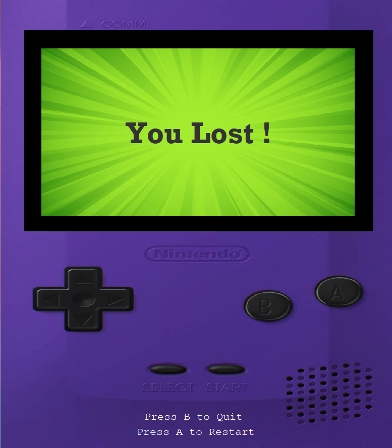

# Java Pokemon Game

## Description
A turn-based Pokémon-style battle game built in Java with a Swing GUI, featuring:
- 18 unique Pokémon
- All official Pokémon types with accurate type-effectiveness
- Individual stats, abilities and moves
- Sound effects and background music
- Interactive graphical interface with sprites and animations
- A strategic CPU opponent who is designed to defeat you

## Gameplay
Select your Pokémon from a diverse roster, face off in a one-on-one battle against a CPU-controlled opponent that aims to win using supereffective and timely status moves. Intense background music adorns the battle as sound effects and animations signify move usage. Quit or restart at any time using the A and B buttons on the simulated Gameboy background.

## Download

### [Download the game here!](https://github.com/janifkader/Java-Pokemon-Game/raw/main/PokemonClone.jar)

## Images

